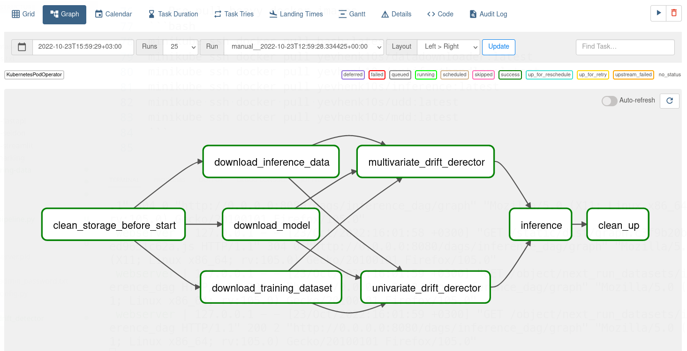

# Data Monitoring

## Infrastructure Set Up

1. Set Up Cluster

```bash
minikube start --cpus=4 --memory=10Gi
```

2. Install Airflow (`week-4-airflow`)
```bash
export AIRFLOW_HOME=$(pwd)/airflow-home
```

2. Install WandB
```bash
export WANDB_API_KEY=e0167fdb4efa7f6ff6b894b426606787a044fa9c
export WANDB_PROJECT=artifact-storage
```

## Data Preparation

1. Get initial training data set

```bash
python ../week-4-kuberflow-pipelines/load-data/download-dataset.py --n-samples=300 --noise=0.0 --random-state=0 --out-file=inference-dataset.json
```

2. Get simulated data for inference with the different amount of noise and random state

```bash
python ../week-4-kuberflow-pipelines/load-data/download-dataset.py --n-samples=300 --noise=0.6 --random-state=1337 --out-file=dataset.json
```

3. Get trained the model from registry

```bash
wandb artifact get yevhen-k-team/artifact-storage/model:latest --root .
```

## PR1: univariate data drift testing

Test inference data against univariate data drift

```bash
python multivariate_drift_detector/multivariate_drift_detector.py --model-path cls.pekl --data-path dataset.json --inference-data-path inference-dataset.json --threshold 0.05
```

## PR2: multivariate data drift testing

Test inference data against multivariate data drift

```bash
python multivariate_drift_detector/multivariate_drift_detector.py --model-path cls.pekl --data-path dataset.json --inference-data-path inference-dataset.json --threshold 0.05
```

## PR3: Update airflow inference pipeline with data monitoring 

1. Build and test docker for **multivariate** drift detection
```bash
cd multivariate_drift_detector
docker build --rm -t mdd .                   
docker tag mdd:latest yevhenk10s/mdd:latest
docker push yevhenk10s/mdd:latest
```

2. Build and test docker for **univariate** drift detection
```bash
cd univariate_drift_detector
docker build --rm -t udd .                   
docker tag udd:latest yevhenk10s/udd:latest
docker push yevhenk10s/udd:latest
```

3. Pre-pull heavy docker images
```bash
minikube ssh docker pull bash:latest
minikube ssh docker pull yevhenk10s/datadownloader:latest
minikube ssh docker pull yevhenk10s/artifacthandler:latest
minikube ssh docker pull yevhenk10s/inference:latest
minikube ssh docker pull yevhenk10s/udd:latest
minikube ssh docker pull yevhenk10s/mdd:latest
```

Final Pipeline:


